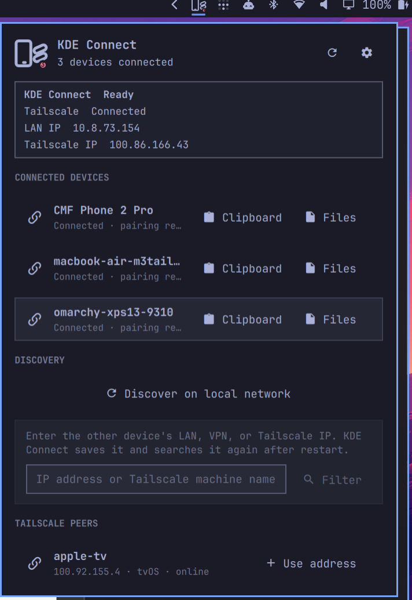

# OmaKDEConnect



OmaKDEConnect puts KDE Connect in the Omarchy bar with a focus on devices that
are not always on the same physical LAN. Its optional, direct Tailscale
integration finds peers across networks and adds their stable addresses to KDE
Connect; KDE Connect still owns pairing, encryption, clipboard synchronization,
and file transfer.

## KDE Connect beyond the LAN

KDE Connect's automatic discovery is LAN-oriented. OmaKDEConnect adds an
optional setup path for devices connected to the same Tailscale network:

- Reads peers locally from `tailscale status --json` without an API token
- Shows Tailscale machine names and filters by machine name, host name, DNS name, IP address, or OS
- Adds a selected peer's stable Tailscale IPv4 address to KDE Connect's saved custom addresses
- Shows this computer's LAN and Tailscale IPv4 addresses so another device can connect back

After an address is added, KDE Connect handles the encrypted pairing and data
transfer over that network path. Tailscale is not required: normal LAN
discovery and manually entered LAN or VPN addresses remain available.

## Features

- Shows connected, paired KDE Connect devices in the Omarchy bar
- Discovers devices on the current LAN and starts pairing from the panel
- Reads online and offline peers from a running Tailscale client and displays their Tailscale machine names
- Filters Tailscale peers by machine name, host name, DNS name, IP address, or OS from the address field
- Adds Tailscale, LAN, or other VPN IP addresses to KDE Connect
- Remembers custom addresses and previously paired devices across restarts
- Shows KDE Connect's verification key and accepts or rejects incoming pairing requests in the panel
- Shows device battery and charging status when the peer exposes it
- Only shows actions supported by each device, including Ring, Ping, Share Text, Clipboard, and Files
- Remembers the preferred send device and selects it the next time the panel opens
- Sends the current desktop clipboard to a selected device
- Opens a native multi-file picker and transfers the selected files
- Reports command success, pairing progress, timeouts, and failures
- Detects KDE Connect, optional Tailscale, and KDE Connect's listening port range, with actionable diagnostics
- Shows this computer's LAN and Tailscale IPv4 addresses for incoming connections
- Opens KDE Connect settings on demand for pairing and advanced features
- Refreshes from KDE Connect D-Bus events, with low-frequency polling as a fallback
- Supports keyboard navigation and smooth inertial scrolling for long device lists

## Requirements

- Omarchy Shell with third-party plugin support
- `kdeconnect`
- KDE Connect on the other device you want to pair
- Optional: Tailscale on both devices, connected to the same tailnet, for cross-network use

When Tailscale is available, OmaKDEConnect lists local tailnet peers so their
stable Tailscale IPv4 address can be added with one click. Manual addresses and
normal LAN discovery continue to work without Tailscale.

For routed VPNs such as Tailscale, add the peer's VPN address in KDE Connect
and allow KDE Connect's TCP/UDP port range (`1714-1764`) on the VPN interface.

## Install

```bash
omarchy plugin add https://github.com/mintisan/OmaKDEConnect.git --enable
```

The plugin declares the right side of the bar as its default location. To move
it explicitly:

```bash
omarchy plugin enable omakdeconnect --section right
```

The plugin is hosted by the already-running Omarchy Shell; there is no
separate OmaKDEConnect process to start. If an installed plugin does not appear:

```bash
omarchy plugin list
omarchy-shell shell rescanPlugins
omarchy plugin enable omakdeconnect --section right
```

As a last step, restart the shell:

```bash
omarchy restart shell
```

The KDE Connect settings window does not need to remain open. Communication is
handled by `kdeconnectd`, which the KDE Connect package registers for desktop
autostart and D-Bus activation. OmaKDEConnect talks directly to that daemon.

## Remove

```bash
omarchy plugin remove omakdeconnect
```

## Use

Click the KDE Connect icon in the right side of the bar, or open it from a
terminal:

```bash
omarchy-shell omakdeconnect open
```

The status card at the top shows this computer's current LAN IPv4 address and
Tailscale IPv4 address, so another device can enter the appropriate address.

- Left or right click: open the connected-device panel
- Middle click: refresh KDE Connect discovery
- `j` / `k` or arrow keys: select a device
- `Enter` or `c`: send the current clipboard
- `f`: choose files to send
- `t`: enter text to share
- `d` or `r`: discover devices on the LAN and saved addresses
- `a`: focus the manual address field
- `p`: pair the first discovered, unpaired device
- `Esc`: close the panel

## Connect a device

1. Open the panel and check the KDE Connect and Tailscale environment status.
2. Choose one discovery route:
   - Select **Discover** for the current LAN and previously saved addresses.
   - Type part of a Tailscale machine name and choose a filtered match.
   - Select a Tailscale peer and choose **Add**.
   - Enter any literal IPv4 or IPv6 address and choose **Add**.
3. Keep KDE Connect open on the other device. When it appears under **Ready
   to pair**, choose **Pair**.
4. Confirm the request on the other device. The panel watches for confirmation
   and moves the device into **Connected devices**.

If the other device starts pairing first, the panel displays **Accept** and
**Reject** instead. Compare the verification key read directly from KDE
Connect and shown in the panel with the key on the other device before
accepting. The KDE Connect app on the other device may need to be open or
allowed to run in the background, depending on that operating system.

A device under **Paired but offline** remains trusted and does not normally
need to be deleted. Wake KDE Connect on the other device and select
**Discover**. If the remote device has lost its trusted state, it returns under
**Ready to pair** and can be paired again directly; remove the old pairing only
if that fails or the remote device identity has changed.

KDE Connect itself stores custom addresses in its `customDevices` setting and
stores trusted-device pairing information. OmaKDEConnect does not maintain a
second, conflicting connection database. Saved addresses can be rediscovered
or removed from the panel. KDE Connect custom addresses accept literal IP
addresses, not URLs, ports, or hostnames.

Clipboard synchronization is subject to the remote operating system's privacy
rules. On recent Android versions, sending the Android clipboard may require an
explicit action on the phone.

Incoming files are still received by KDE Connect itself. In the current KDE
Connect desktop implementation, byte-level receive progress is kept inside its
in-process `KWidgetJobTracker`; the D-Bus share interface only emits the final
`shareReceived` path. OmaKDEConnect therefore leaves the existing KDE Connect
progress window in place rather than displaying a second, inaccurate progress
bar.

## Architecture

OmaKDEConnect talks to the existing `kdeconnectd` process through KDE
Connect's DBus interface and `kdeconnect-cli`. Tailscale peer information comes
from `tailscale status --json`. It does not reimplement either protocol and
does not start a second background daemon. A read-only D-Bus monitor refreshes
device state after reachability, pairing, plugin, and battery events; a
low-frequency poll remains as recovery if an event is missed.

## Validate

```bash
omarchy plugin validate .
node --test tests/model.test.js
```

## License

MIT
